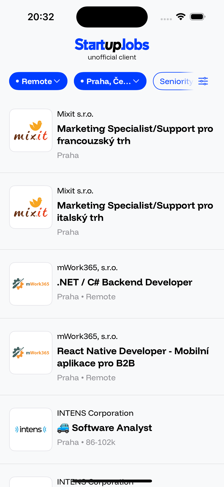
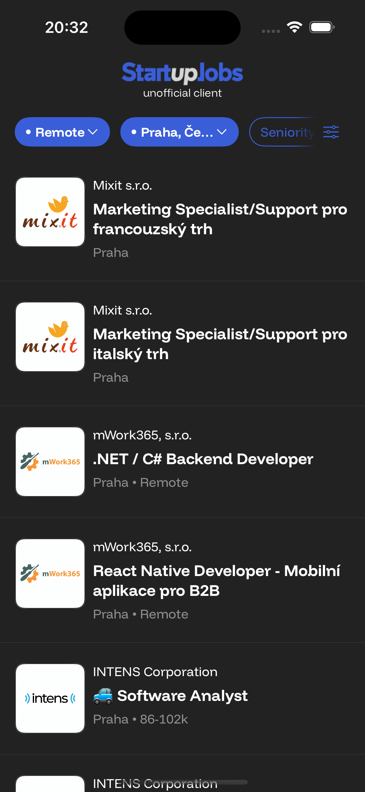

This is an unofficial iOS client for browsing [StartupJobs](https://www.startupjobs.cz/) listings. I wanted to be able to browse jobs while on the go and didn't like the mobile web experience. It's currently in early stages, checkout the [TODO](#todo)

    
    

This is a personal practice project, I'm not affiliated with StartupJobs.

Technologies used:
- [Tuist](https://tuist.dev/) for project setup & modules
- MVVM-C: UIKit navigation with SwiftUI views
- ~~[Quick](https://github.com/Quick/Quick) for testing~~ (Swift Testing for now)
- [Mocker](https://github.com/WeTransfer/Mocker) for request mocking (TBD)

## TODO
- [x]  Networking layer
- [x]  Basic list with infinite scroll
- [x]  Filters sheet
- [x]  Filter data
- [x]  Display active filters (work mode / location / salary / stack / seniority / contract type / startups / benefits)
- [x]  Load dynamic filter values from api
- [x]  All filters sheet
- [x]  Tree filter (work area)
- [x]  Job detail
- [ ]  Company detail w/ their jobs
- [ ]  Refresh data if stale (view x new jobs)
- [ ]  Group by date (Today, yesterday, etc.)
- [ ]  Full screen tiktok style scroll (experimental) – switch between list / fullscreen

### Local jobs tools
- [ ]  Mark job as interested
- [ ]  My jobs tab
- [ ]  Mark all as seen
- [ ]  Save search
- [ ]  Select saved search
- [ ]  Delete saved search
